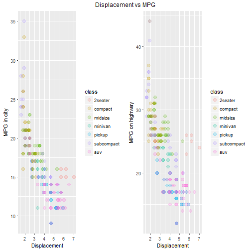

Course Project: Shiny Application and Reproducible Pitch
========================================================
author: Branislav Adamovic
date: December 15, 2017
autosize: true

Summary
========================================================

- This is the final presentation for the **"Developing Data Products"** Course Project.
- This course is part of the **"Data Science Specialization"**.
- This assignment has two parts:
  + creating a shiny application
  + creating a pitch for the application using **Rstudio Presenter**.


Dataset
========================================================


```r
library(ggplot2)
str(mpg)
```

```
Classes 'tbl_df', 'tbl' and 'data.frame':	234 obs. of  11 variables:
 $ manufacturer: chr  "audi" "audi" "audi" "audi" ...
 $ model       : chr  "a4" "a4" "a4" "a4" ...
 $ displ       : num  1.8 1.8 2 2 2.8 2.8 3.1 1.8 1.8 2 ...
 $ year        : int  1999 1999 2008 2008 1999 1999 2008 1999 1999 2008 ...
 $ cyl         : int  4 4 4 4 6 6 6 4 4 4 ...
 $ trans       : chr  "auto(l5)" "manual(m5)" "manual(m6)" "auto(av)" ...
 $ drv         : chr  "f" "f" "f" "f" ...
 $ cty         : int  18 21 20 21 16 18 18 18 16 20 ...
 $ hwy         : int  29 29 31 30 26 26 27 26 25 28 ...
 $ fl          : chr  "p" "p" "p" "p" ...
 $ class       : chr  "compact" "compact" "compact" "compact" ...
```

Predicted variables
========================================================



- In our application we will predict Mileage per Gallon in city (variable "cty") and on highway(variable "hwy").

Shiny application
========================================================

- The objective of the shiny application is to predict Mileage per Gallon in city and on highway with changing of displacement. For this reason 
there were build 2 linear models and put in one plot. You can select also between different car classes. You can show/hide both models and also to
see applied displacement you can show/hide a line showing yor choice. 
- Application can be found [here](http://brano.shinyapps.io/MPG_displ/).
- Source code can be found [here]().
